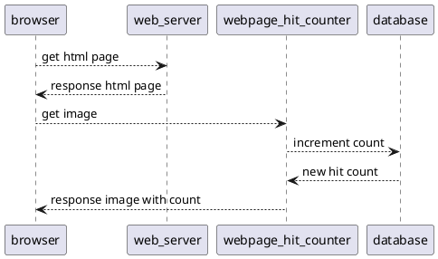

[//]: # (auto_md_to_doc_comments segment start A)

# webpage_hit_counter

[//]: # (auto_cargo_toml_to_md start)

**05. Tutorial for Coding simple Web Server with Database in Rust (webpage_hit_counter) (2022-08)**  
***version: 1.0.59 date: 2022-08-15 author: [bestia.dev](https://bestia.dev) repository: [GitHub](https://github.com/bestia-dev/webpage_hit_counter)***  

[//]: # (auto_cargo_toml_to_md end)

 
 

[//]: # (auto_lines_of_code start)
[](https://github.com/bestia-dev/webpage_hit_counter/)
[](https://github.com/bestia-dev/webpage_hit_counter/)
[](https://github.com/bestia-dev/webpage_hit_counter/)
[](https://github.com/bestia-dev/webpage_hit_counter/)
[](https://github.com/bestia-dev/webpage_hit_counter/)

[//]: # (auto_lines_of_code end)

  [](https://github.com/bestia-dev/webpage_hit_counter/blob/main/LICENSE)
  [](https://github.com/bestia-dev/webpage_hit_counter/)
  

Hashtags: #rustlang #tutorial #pwa #webserver #actix #database #postgres
My projects on GitHub are more like a tutorial than a finished product: [bestia-dev tutorials](https://github.com/bestia-dev/tutorials_rust_wasm).

## Intro

Welcome to bestia.dev !  
Learning Rust and Wasm programming and having fun.  
I just love  programming !  

This is my fifth video tutorial about programming in Rust.  
In this tutorial I will show step by step how to create a simple web server with a database.  
I am using the Rust development environment inside a docker container we created in the first two video tutorials. You can find them in my youtube channel :"bestia dev Tutorials for Rust programming language". Just type "bestia dev" in the youtube search box.  

This project has also a youtube video tutorial. Watch it:
<!-- markdownlint-disable MD033 -->
[](https://bestia.dev/youtube/webpage_hit_counter.html)
<!-- markdownlint-enable MD033 -->

## webpage hit counter

Today's project is a "webpage hit counter".
I want to see the number of visitors to my webpages. There are many different options, but the simplest one is an old-school webpage hit counter.  
<https://en.wikipedia.org/wiki/Web_counter>
This is nothing more then an image on the page that is sourced from a web application. This web application can then count the hits and dynamically produce a picture with the number of hits. We are lucky that images (for now) don't have limitation for cross-domain or cross-origin. I will not really count unique visitors, because that is complicated. I will count simply every hit.  



## Project for tutorial

This is a perfect simple example how to use a Web server and a database in Rust.  
I choose the crate Actix-web for my web server, because it looks very popular among Rustaceans. I don't know if other Rust web servers are better or worse. I need something really super simple and I don't want to complicate analyzing every existing web-server crate.  
<https://actix.rs/>  
I choose PostgreSQL or Postgres as my preferred database because I have a long history with MSSQL and they look fairly similar. I also heard a lot of good opinions about Postgres.  
<https://www.postgresql.org/>  

## Postgres in a container

My Rust development environment is a podman pod with 2 containers. I will add to that pod a new container for the Postgres server and one with the pgAdmin management tool.  
I enhanced the script crustde_pod_create.sh from my project crustde_cnt_img_pod and started the new pod. A new port 9876 will be used for pgAdmin.  
I will now force the reboot of WSL to demonstrate how to restart the pod. In powershell run as administrator I use "Get-Service LxssManager | Restart-Service".
After reboot I need a small bash script to restart the pod, because of the peculiarities of WSL.
<https://github.com/CRUSTDE-ContainerizedRustDevEnv/crustde_cnt_img_pod>

## pgAdmin create database and tables

Now we can open the pgAdmin management tool inside a browser on the address localhost 9 8 7 6.  
For this tutorial we will not deep dive into database security. We will use just the admin user role. This is a big no no in production.  
First create a new database named webpage_hit_counter.  
The first table will be a list of webpages with their unique integer id.

A table is made of columns and rows or synonymous of fields and records.

The second table will have a foreign key to the webpage table and the number of hits. The serial datatype automatically increases on every insert command and is therefor unique.  
I forgot to assign the primary key to the tables.
We will add the foreign key to define the relation between the tables. And we will set the columns to not null.  
That is all for now about the Postgres database. The data will be inserted from the Rust code.

## Template project with cargo auto new_cli

We will create a template CLI project using "cargo auto new_cli".
Open VSCode, press F1, remote-ssh connect to host, enter passphrase. In the rustprojects directory create a new template Rust project named webpage_hit_counter. Open it in a new VSCode window.
Build it with "cargo auto build" and run it. Just to check that everything is ok.  
Eureka, it works!

## Actix web server

Let begin our discovery of actix-web with a simple Hello World example. Classic getting started stuff!
<https://actix.rs/docs/getting-started/>  
I will comment or delete the code I don't need and replace it with the code from the example.
I use the VSCode extension "crates from Seray Uzgur" to check the last version of the crate and quickly open the documentation.  
<https://marketplace.visualstudio.com/items?itemName=serayuzgur.crates>  

Let rename the module and copy the code from the example.
I like to leave some parts of the template code for future use.  
Functions that are used outside the module must be public.
Lib.rs has a big segment of doc-comments. We can fold it quickly with the fold marker.
We need to rename the module and allow use of all functions from it.
The main function is copied into the bin main.rs file.
Now we copy the use statement. We can delete the unused objects.
The bin main.rs is a separate part of the project and we must write a use statement for the library project.
In the explorer side panel we can see in yellow the modules that have warning and in red the ones with errors. We can clean this problems easily.
With F1 we got all the VSCode functions under our fingertips. I need to Comment the code. Sometimes typing is faster than using the mouse.
We can now build the project with cargo auto build.
In VSCode we have to open the port 8080, so that we can access the container from our browser.
Run the compiled code without any parameters.
Now open the browser on localhost port 8080.  
Hello world! It works. Let's try with another function.
The routing for Hey calls the functions manual_hello and writes "Hey there!".

## new route

We will now modify the code for our example. We need only one route named webpage_hit_counter/get_svg_image. It will call the function with the same name.  
I like to use Rust raw string, because I can copy paste literal text without modifying it.
We will return a svg file for the badge. Svg is simple xml text, nothing complicated.
Let's build the project and open it in the browser.
We need to add the MIME type so the browser can render the svg instead of showing the text.
We need a new dependency crate for mime.
There is need for a few modification to main and the automation tasks. Nothing big.
We can now build the project and open the URL in the browser.  
Hooray! We can now see the SVG image for the badge with the word "Hits" and the number 14. Pretty neat!

## data in the database

Now we need to insert some data into the database. I will use the pgAdmin management tool. There is a graphical way to write data, but I will use SQL statements. Sooner or later we need to write SQL statements. And they are not so difficult. The basics is only 4 words: SELECt, UPDATE, INSERT and DELETE.
In this table the id will be a random number. Our first row or record is for testing purposes.
Into the second table we don't need to define the id because it is incremented automatically. The webpage_id must create a relation with the record in the webpage table and for now we choose a sample hit count for example 3.

```sql
insert into webpage(id, webpage)
values(555555, 'test')

insert into hit_counter(webpage_id, count)
values(555555, 3)
```

## Postgres and Rust

We will find an example how to write Rust code to select data from the Postgres database.  
I choose the asynchronous Tokio client because it matches the Tokio runtime of Actix-web.  
<https://docs.rs/crate/tokio-postgres/0.7.6>  
This is a good moment to create a git repository because we will experiment a little bit with the postgres code.
I use ssh-agent and ssh-add to store my credentials for GitHub.
We add the tokio-postgres crate to cargo.toml. We create a new module for postgres and a new function based on the example that read the hit count from the table. We have to add the new module to lib.rs. In the actix module we call the function and print the result to the terminal.
ok. Build it, open it in the browser. It works. Check the terminal and we see the number 3 that was read from the table. Perfect.
We want this number to show up in the SVG image. That is simple, because SVG is just an XML text. We will use the new format syntax from Rust edition 2021.
Works perfectly!
Time for a git commit and push.
<https://chamook.lol/rust-web-service/>

## connection pool

Opening a connection to the database every time the server gets a request is not ideal. We need a connection pool to share the same connection for sequential requests efficiently. We can use the deadpool crate.

We will use the rust-dotenv crate to keep database connection and configuration values in a config file with the name `.env`.
<https://chamook.lol/rust-web-service/>

We add also the dependency crate deadpool-postgres.
We will make a new module for deadpool to have things neatly separated.  
First we load the env variables.
This is a special deadpool-postgres crate and works with postgres configuration objects.
We add the new module to lib.rs.
Now we can call this function from the main function.
Actix can seamlessly pass objects to functions if we use app-data. In this case we pass the cloned pool object.
I want to write when the server stops in the terminal.
We can now add the pool parameter to our request handler and pass it to our database call.  
We need one client connection from the pool.
This closure must be "move" now.
For debugging I want to write to the terminal when the request is executed.
Build and try. Refresh a few times. In the terminal we can see multiple requests. It works.

## parameter

We will now introduce the parameter webpage_id, so we can count hits on many different pages.  
In pgAdmin insert new records in webpage and in hit_counter. The id will be random 6 times 7 and the count 17 for now. We will use the Query tool and write SQL statements.

```sql
insert into webpage(id, webpage)
values(777777, 'test2')

insert into hit_counter(webpage_id, count)
values(777777, 17)
```

In this tutorial we will not create a user interface to add webpages. That is reserved for my next tutorial.

Actix has integrated tools to extract parameters from URL paths. It is easy. Just use the right syntax for the route.
Accept the new parameter and then pass it to the postgres function.
Then pass this parameter to the SQL statement in the WHERE clause.
Build and try with different parameters. The first return 3 hits, the second returns 17 hits. Hooray! It works!

## increment

The final step of the development is to increment the hit counter every time we got the request. We will write another simple SQL statement before selecting the value.
Build, try, works. Done !

## how to use it

We can create a simple example page how to use our webpage_hit_counter.
It can be just a single page passive file index.html.  
The Show preview command for html is added by the Live Preview Extension for VSCode. I use it because the VSCode server is running inside a docker container.  
Marvelous. I like the graphic part too!

## Outro

In this tutorial I will not go into details how to deploy it to my web server. Maybe in another tutorial.

This is all for today.  
Thank you for watching and see you next time.  
Feel free to contact me on bestia.dev or github.

## Adding new webpages into the database

I created a bash script to insert a webpage in the webpage_hit_counter database on bestia.dev over SSH in one command.  
Use sshadd to enter the passphrase for the SSH connection beforehand.  
The bash script needs 1 arguments: `host_name` like this:  

```bash
sh ssh_psql_insert_webpage.sh test.com
```

## Alpine and musl

2023-11-19
I will compile the program to target musl to be used with Alpine docker image.  
It is smaller and it does not depend on the version of Debian. I had problems when compiling to Debian 12 and then try to create the container on Debian 11.  

## deploying_rust_server_and_database

Read and watch the next tutorial deploying_rust_server_and_database.

## cargo crev reviews and advisory

We live in times of danger with [supply chain attacks](https://en.wikipedia.org/wiki/Supply_chain_attack).  
It is recommended to always use [cargo-crev](https://github.com/crev-dev/cargo-crev)  
to verify the trustworthiness of each of your dependencies.  
Please, spread this info.  
You can also read reviews quickly on the web:  
<https://web.crev.dev/rust-reviews/crates/>  

## Open-source and free as a beer

My open-source projects are free as a beer (MIT license).  
I just love programming.  
But I need also to drink. If you find my projects and tutorials helpful, please buy me a beer by donating to my [PayPal](https://paypal.me/LucianoBestia).  
You know the price of a beer in your local bar ;-)  
So I can drink a free beer for your health :-)  
[Na zdravje!](https://translate.google.com/?hl=en&sl=sl&tl=en&text=Na%20zdravje&op=translate) [Alla salute!](https://dictionary.cambridge.org/dictionary/italian-english/alla-salute) [Prost!](https://dictionary.cambridge.org/dictionary/german-english/prost) [Nazdravlje!](https://matadornetwork.com/nights/how-to-say-cheers-in-50-languages/) 🍻

[//bestia.dev](https://bestia.dev)  
[//github.com/bestia-dev](https://github.com/bestia-dev)  
[//bestiadev.substack.com](https://bestiadev.substack.com)  
[//youtube.com/@bestia-dev-tutorials](https://youtube.com/@bestia-dev-tutorials)  

[//]: # (auto_md_to_doc_comments segment end A)
